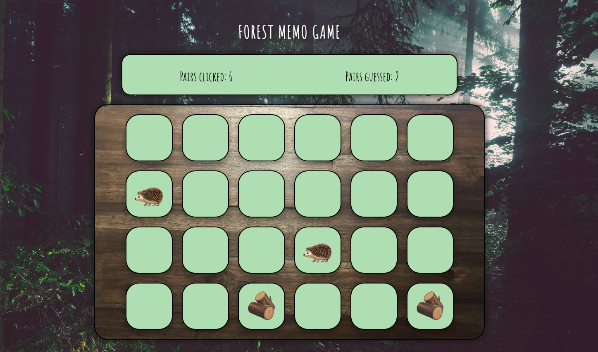

# Forest Memo Game #
## Overview ##
Forest Memo Game - a fun and kid-friendly memory game where the player have to find pairs of forest related emoji cards. The goal is to find all matches as quickly as possible.

## Features ##
Random Shuffle: Every time the game restarts, the cards are shuffled randomly.
Show Scores: They show the number of pairs guessed and the number of attempts.
Responsive Design: It adapts to different screen sizes so the game looks good on all devices.
Kid-friendly Design: Bright, cheerful background and kid-friendly emojis.

## Installation and use ##
### Requirements ###
A web browser (e.g. Chrome, Firefox, Safari)

### How to play ###
Open the game in the browser.
Click on a card to reveal it.
Try to find the matching pairs by clicking on two cards one after the other.
If two cards match, they remain face up. If not, they are covered again.
The game ends when all pairs have been found.
Monitor your progress with the saved games displayed.

## Technologies used ##
HTML: HTML contains the structure of the game.
CSS: A deliberately simple CSS styling that controls the design and layout of the game.
TypeScript: TypeScript that implements the game's logic, including card shuffling and event control.

## Preview ##
